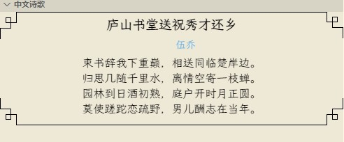

# 唐诗宋词

**望江南·超然台作**

苏轼 〔宋代〕

春未老，风细柳斜斜。试上超然台上看，半壕春水一城花。烟雨暗千家。 寒食后，酒醒却咨嗟。休对故人思故国，且将新火试新茶。诗酒趁年华。   

这是一个显示唐诗宋词的小插件，目前只收录了唐诗和宋词，在写代码累了的时候放松下思维，陶冶下情操。

**推荐安装使用字体: [落霞孤鹜](https://github.com/lxgw/LxgwWenKai)**    
**诗词数据来源: [chinese-poetry](https://github.com/chinese-poetry/chinese-poetry)**